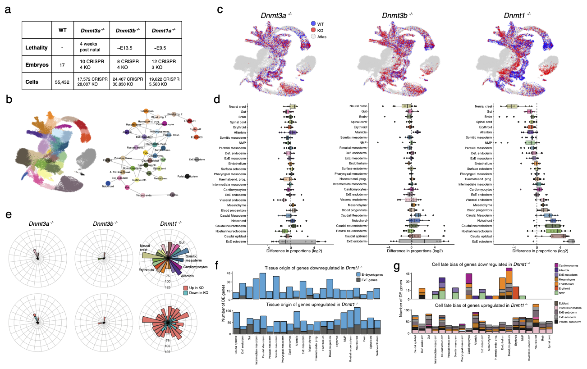

# Single-cell multi-omics profiling links dynamic DNA methylation to cell fate decisions during mouse early organogenesis

This repository contains the scripts to reproduce the DNMT KO analysis of [our study](XXX). It covers most of Figures 1-2 as well as Supplementary Figures 1-4.
The source code for the second part of the paper, where we explore the Tet TKO embryos, is available in [this repository](https://github.com/rargelaguet/10x_gastrulation_TetChimera)

 

Experimental design
--------
We generated *Dnmt1*-/-, *Dnmt3a*-/- and *Dnmt3b*-/- embryos together with matching wildtypes from heterozygous matings. We collected embryos at E8.5, when progenitor cells for all major organs have formed and methylation mutants are not yet lethal, and performed scRNA-seq. To increase the statistical power of our analysis we combined our data set of KO embryos with a [published data set](https://www.nature.com/articles/s41586-020-2552-x) where *Dnmt1*, *Dnmt3a* and *Dnmt3b* were disrupted using CRISPR-Cas9 and also profiled using scRNA-seq at E8.5. In total, our analysis comprises 51,811 cells from 17 WT embryos, 45,579 cells from 14 *Dnmt3a*-/- embryos, 55,237 cells from 12 *Dnmt3b*-/- embryos and 25,185 cells from 15 *Dnmt1*-/- embryos. We assigned celltype labels by mapping the RNA expression profiles to a [reference atlas that spans E6.5 to E8.5](https://www.nature.com/articles/s41586-019-0933-9)

Key results
--------

- *Dnmt3a*-/- and *Dnmt3b*-/- embryos show relatively minor defects in cell type proportions. In contrast, *Dnmt1*-/- embryos show widespread defects in cell type proportions, including a relative overrepresentation of ExE ectoderm and immature embryonic cell types such as rostral neuroectoderm and caudal epiblast. We also observe a relative underrepresentation of some mature embryonic cell types, including Neural crest, NMPs, Brain, Spinal cord and Gut cells.  

- We find a small number of DE genes when comparing *Dnmt3a*-/- and *Dnmt3b*-/- to WT samples. In contrast, we find a large number of DE genes in the *Dnmt1*-/- KO across most cell types, but particularly in the Neural crest, Caudal mesoderm and Blood progenitors.  

- Posterior Hox genes (for example *Hoxc9*, *Hoxc8*, *Hoxb9* and *Hoxa9*) are downregulated in posterior cell types of *Dnmt1*-/- KO cells, including NMPs, somitic mesoderm, intermediate mesoderm and ExE mesoderm.  

- Among the genes that are upregulated in the *Dnmt1*-/- KO we observe primed pluripotency markers (*Pou5f1*, *Utf1*, *Slc7a3*, *Fgf5* and *Pim2*) and ExE marker genes (*Rhox5*, *Krt8*, *Apoe*, *Ascl2*, *Trap1a* and *Xlr3a*) across most cell types.

<!-- Content
-------
* `/met/`: analysis of DNA methylation data
* `/acc/`: analysis of chromatin accessibility data
* `/rna/`: analysis of RNA expression data
* `/metacc/`: simultaneous analysis of DNA methylation and chromatin accessibility data
* `/metrna/`: simultaneous analysis of DNA methylation and RNA expression data
* `/accrna/`: simultaneous analysis of chromatin accessibility and RNA expression data
* `/metaccrna/`: simultaneous analysis of all three omics (MOFA)
* `/H3K27ac/`: analysis of the H3K27ac levels in lineage-defining enhancers -->

Data
-------
Raw data is available at [GEO](https://www.ncbi.nlm.nih.gov/geo/query/acc.cgi?acc=GSE204908).  
Parsed data can be downloaded [in progress...](https://www.ncbi.nlm.nih.gov/geo/query/acc.cgi?acc=GSE204908).  

R Shiny app
-------
Interactive R shiny app is available [here](https://www.bioinformatics.babraham.ac.uk/shiny/dnmt_ko_embryo_scrna/).  

Contact
-------

For questions on the computational analysis: Ricard Argelaguet (ricard.argelaguet@gmail.com). For questions on the experimental work: Tim Lohoff (tlohoff431@gmail.com) or Stephen Clark (Stephen.Clark@babraham.ac.uk)

